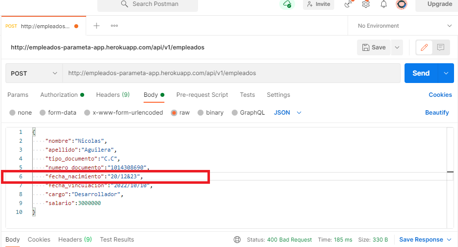

# Prueba de conocimiento Junior Developer - Paramētā S.A.S

En esta prueba se va a desarrollar : 

- Un servicio Rest que reciba como parámetros los atributos del objeto empleado al ser invocado mediante el método POST.
- El servicio validará que los formatos de las fechas y que los atributos no vengan vacíos. Adicionalmente validaráque el empleado sea mayor de edad. Una vez se hayan
superado estas validaciones se almacernará la información en una base de datos mysql.
- El Servicio Web responderá con el objeto en estructura JSON, en el que se deberá adicionar la
siguiente información: Tiempo de Vinculación a la compañía (años, meses), Edad actual del empleado (años, meses y días)


## Prerequisitos

* [Gradle](https://gradle.org/) - Administrador de dependencias
* [Java 8](https://www.oracle.com/co/java/technologies/javase/javase-jdk8-downloads.html) -  Entorno de desarrollo 
* [Git](https://git-scm.com/) - Sistema de control de versiones
* [Postman](https://www.postman.com/) - Plataforma API para contruir y usar APIs

## Instalacion y ejecución

### Ejecución mediante endpoint en Heroku

1. El siguiente endpoint desplegado en Heroku está disponible para hacer uso de la aplicación ```http://empleados-parameta-app.herokuapp.com/api/v1/empleados```

[](http://empleados-parameta-app.herokuapp.com/api/v1/empleados)

[](https://app.circleci.com/pipelines/github/NicolasAguilera9906/Empleados-App-Parameta-S.A.S)

### Instalación y ejecución mediante Gradle

1. Clone el repositorio

```
https://github.com/NicolasAguilera9906/Empleados-App-Parameta-S.A.S
```

2. Entre a la raiz del repositorio


3. Compile el proyecto ingresando el siguiente comando en el CMD (Command Prompt)

```
gradlew bootrun
```


4. Una vez el proyecto haya sido ejecutado correctamente observará el siguiente mensaje indicando que la aplicación ahora está corriendo en ```http://localhost:8080/```


## Uso y casos de prueba

1. La aplicación nos permitirá añadir un nuevo empleado perteneciente a la compañia. Este empleado es recibido por medio del cuerpo de la petición utilizando HTTP POST en formato JSON. De esta manera, un empleado se verá de la siguiente manera : 

```
{
    "nombre":"Nicolás",
    "apellido":"Aguilera Contreras",
    "tipo_documento":"C.C",
    "numero_documento":"1014308690",
    "fecha_nacimiento":"1999/10/06",
    "fecha_vinculacion":"2022/01/01",
    "cargo":"Desarrollador",
    "salario":3000000
}
```

2. Para realizar la prueba de cada uno de los casos de prueba haremos uso de [Postman](https://www.postman.com/). Allí crearemos una nueva colleción con el método Post 
con la dirección ```http://empleados-parameta-app.herokuapp.com/api/v1/empleados``` si ejecutamos la aplicación desde Heroku, o ```http://localhost:8080/api/v1/empleados``` si ejecutamos la aplicación localmente


3. En la parte inferior especificaremos el cuerpo de la petición. Allí incluiremos al empleado en formato JSON :


### Añadir un nuevo empleado

1. Realizamos una peticion HTTP con el siguiente usuario :


2. El usuario es agregado correctamente a la base de datos y obtenemos la siguiente respuesta, en donde se incluye la edad del empleado y el tiempo que se encuentra trabajando en la compañia :


### Validación de campos vacíos

1. Vamos a no incluir un campo a proposito de tal manera que podamos observar la validación de campos vacíos. En este caso, no incluiremos el apellido del Empleado el cual se verá de la siguiente manera :


2. Vemos que al momento de enviar la petición se obtiene el siguiente mensaje de error validando el campo vacio:


3. También puede ocurrir el caso de que el atributo se encuentre presente pero no tenga valor. En este caso observamos que el apellido es igual a "" :


4. Al momento de enviar la petición obtenemos el mismo mensaje de error:


### Validación del formato de la fecha

1. La fecha debe seguir el siguiente formato : ```yyyy/mm/dd```. Vamos a incluir a proposito una fecha que no siga ese formato como se observa a continuación



2. Al momento de enviar la petición obtendremos el siguiente mensaje de error alertando sobre la petición incorrecta : 


3. Adicionalmente, también puede ocurrir que la fecha se encuentre en el futuro, lo cual no sería lógico ni para la fecha de nacimiento ni para le fecha de vinculación. Así, incluiremos este caso a proposito en la fecha de nacimiento :


4. Al momento de enviar la petición obtendremos el siguiente mensaje de error alertando sobre la fecha establecida en el futuro : 


### Validación Empleado mayor de edad

1. En este caso añadiremos un empleado que no es mayor de edad como observamos a continuacion:


2. Al intentar añadir obtendremos el siguiente mensaje de error indicando que el Empleado es menor de 18 años 


## Arquitectura

### Diagrama de despliegue

1. La aplicación Java (SpringBoot) se encuentra desplegada en Heroku.
2. Además, la aplicación se comunica con una base de datos relacional mysql por medio de el siguiente servicio se hosting : https://www.freemysqlhosting.net/


### Estructura de la aplicación 

La aplicación tiene 4 principales componentes :

1. Controladores : Se encarga de recibir las peticiones HTTP en formato JSON. En este caso, recibe peticios HTTP Post para agregar nuevos Empleados.
2. Modelos : Define los modelos de la aplicación. En este caso hay un modelo que define la clase Empleado.
3. Persistencia : Contiene las interfaces que extienden de JPA para que estas clases se conecten a la base de datos MYSQL. Hay una interfaz de persistencia y una implementación específica, lo que permite facilitar su extensión o la adición de funcionalidades distintas para métodos iguales.
4. Servicios : Conecta la capa de controlares con la capa de persistencia ofreciendo los servicios de la aplicación de empleados. Hay una interfaz de servicios y una implementación específica, lo que permite facilitar su extensión o la adición de funcionalidades distintas para métodos iguales.

## Documentacion

Ver [Documentacion](https://nicolasaguilera9906.github.io/Empleados-App-Parameta-S.A.S/javadoc/index.html)

## Autor

* **Nicolás Aguilera Contreras** 

## Licencia

Este proyecto está bajo la GNU General Public License - ver el archivo [LICENSE](LICENSE) para más detalles.

